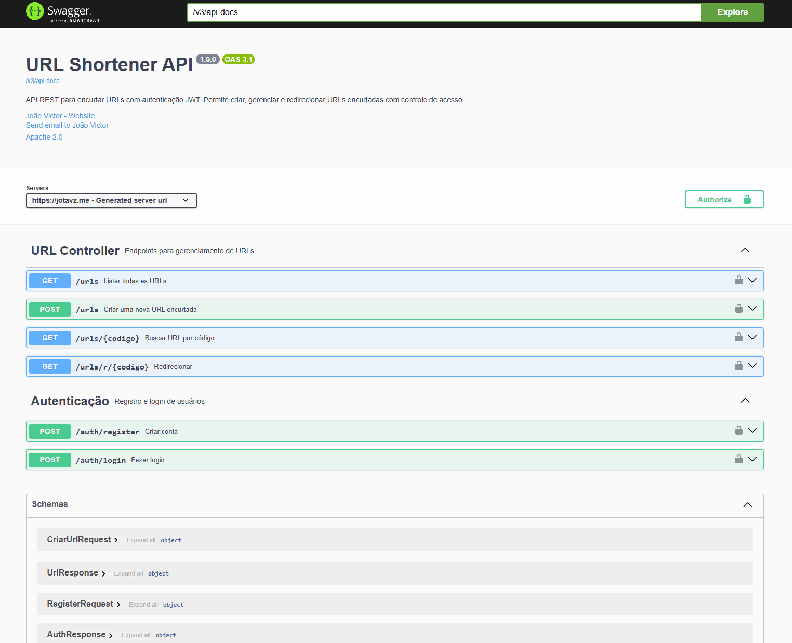

# URL Shortener API

API REST de encurtador de URLs desenvolvida em **Java com Spring Boot**, com autenticação via JWT, persistência em PostgreSQL e deploy containerizado com Docker.


---

## 📋 Sobre o projeto

Este projeto foi desenvolvido como forma de aprender e aplicar, na prática, os fundamentos do desenvolvimento backend com Java — desde a linguagem em si até arquitetura, segurança, testes e deploy em produção.

A API permite criar contas de usuário, autenticar via JWT, encurtar URLs, redirecionar para o link original e acompanhar o número de acessos de cada link — seguindo boas práticas de arquitetura em camadas e separação de responsabilidades.

---

## 🚀 Funcionalidades

- Cadastro e login de usuários com autenticação JWT
- Criação de URLs encurtadas
- Redirecionamento automático para a URL original
- Contador de acessos por URL
- Listagem e busca de URLs por código
- Tratamento global de erros com respostas padronizadas
- Documentação interativa via Swagger/OpenAPI

---

## 🛠️ Tecnologias utilizadas

**Linguagem e Framework**
- Java 21
- Spring Boot 3.5
- Spring Web
- Spring Data JPA
- Spring Security

**Banco de dados**
- PostgreSQL
- Hibernate (JPA)

**Segurança**
- JWT (JJWT 0.12.6)
- BCrypt para hash de senhas

**Testes**
- JUnit 5
- Mockito

**Documentação**
- SpringDoc OpenAPI (Swagger UI)

**Build e Deploy**
- Maven
- Docker (multi-stage build)
- Docker Compose
- Railway (hospedagem + banco gerenciado)

**Ferramentas**
- IntelliJ IDEA
- Git / GitHub

---

## 🏗️ Arquitetura

O projeto segue uma arquitetura em camadas, separando responsabilidades:

```
src/main/java/com/joaodev/urlshortener/
├── controller/     # Recebe requisições HTTP e retorna respostas
├── service/        # Contém as regras de negócio
├── repository/     # Comunicação com o banco de dados (Spring Data JPA)
├── entity/         # Representações das tabelas do banco
├── dto/            # Objetos de entrada e saída da API (Records)
├── exception/       # Exceções personalizadas e tratamento global de erros
└── security/        # Configuração do Spring Security, JWT e filtros
```

---

## 🔐 Autenticação

A API utiliza autenticação stateless via **JWT**. O fluxo funciona assim:

1. O usuário se registra ou faz login em `/auth/register` ou `/auth/login`
2. A API retorna um token JWT válido por 24 horas
3. O token deve ser enviado no header `Authorization: Bearer <token>` nas requisições às rotas protegidas
4. As rotas `/auth/**` e `/urls/r/**` (redirecionamento) são públicas — as demais exigem autenticação

---

## 📖 Documentação da API

A documentação completa e interativa está disponível via Swagger UI:

 **[https://jotavz.me/docs](https://jotavz.me/docs)**

Nela é possível visualizar todos os endpoints disponíveis, seus parâmetros, respostas esperadas e testar as requisições diretamente pelo navegador.

---

## 🐳 Rodando o projeto localmente com Docker

Pré-requisitos: Docker e Docker Compose instalados.

```bash
# Clone o repositório
git clone https://github.com/jotavq/urlshortener-api.git
cd urlshortener-api

# Suba os containers (API + PostgreSQL)
docker compose up --build
```

A API estará disponível em `http://localhost:8080` e a documentação em `http://localhost:8080/docs`.

---

## 🧪 Rodando os testes

```bash
./mvnw test
```

O projeto conta com testes unitários cobrindo as principais regras de negócio das camadas de Service, utilizando JUnit 5 e Mockito para simulação de dependências.

---

## 📦 Principais endpoints

| Método | Rota                | Descrição                              | Autenticação |
|--------|---------------------|-----------------------------------------|:---:|
| POST   | `/auth/register`    | Cria uma nova conta de usuário          | ❌ |
| POST   | `/auth/login`        | Autentica e retorna o token JWT         | ❌ |
| POST   | `/urls`               | Cria uma nova URL encurtada             | ✅ |
| GET    | `/urls`               | Lista todas as URLs                     | ✅ |
| GET    | `/urls/{codigo}`      | Busca uma URL pelo código               | ✅ |
| GET    | `/urls/r/{codigo}`    | Redireciona para a URL original         | ❌ |

Documentação completa e testável em [`/docs`](https://jotavz.me/docs).

---

## 🔭 Possíveis melhorias futuras

Algumas funcionalidades e melhorias que fazem sentido como próximos passos do projeto:

- [ ] **Desativação de URLs** — permitir que o usuário desative uma URL manualmente (a entidade já possui o campo `ativa`, falta expor essa ação via endpoint)
- [ ] **Verificação de URL ativa no redirecionamento** — impedir redirecionamento de URLs desativadas ou expiradas, retornando erro apropriado
- [ ] **Expiração de links** — adicionar data de expiração configurável na criação da URL, com verificação automática
- [ ] **Paginação** — implementar paginação no `GET /urls` usando `Pageable` do Spring Data, para suportar grandes volumes de dados
- [ ] **Vínculo entre URL e usuário** — relacionar cada URL ao usuário que a criou, permitindo listar apenas as URLs do usuário autenticado
- [ ] **Exceções de negócio mais específicas** — substituir `RuntimeException` genérica (usada no `AuthService`) por exceções personalizadas, como `EmailJaCadastradoException`
- [x] **Validação de entrada** — usar Bean Validation (`@Valid`, `@NotBlank`, `@Email`) nos DTOs de requisição
- [ ] **Rate limiting** — limitar a quantidade de URLs criadas por usuário em um intervalo de tempo, evitando abuso
- [ ] **CI/CD com GitHub Actions** — rodar os testes automaticamente a cada push, antes do deploy no Railway
- [ ] **Migrations com Flyway** — versionar as alterações do schema do banco de dados
- [ ] **Cache com Redis** — cachear URLs mais acessadas para reduzir consultas ao banco no redirecionamento
- [ ] **Métricas e observabilidade** — adicionar Spring Actuator para monitoramento de saúde da aplicação
- [ ] **Restringir CORS** — atualmente liberado para qualquer origem (`*`); em um cenário com frontend definido, restringir para o domínio específico

---

## 🖥️ Demo

### Autenticação

Autenticação é feita via JWT. Para testar, você pode usar o Swagger UI ou ferramentas como Postman.


---
### Criação de URL
Para criar uma URL encurtada, envie uma requisição POST para `/urls` com o corpo JSON contendo a URL original. A resposta incluirá o código gerado e a URL encurtada.

URL encurtada te redirecionar para o Google: **[https://jotavz.me/urls/r/faa849](https://jotavz.me/urls/r/faa849)**




---

## 👤 Autor

Desenvolvido por **João** como projeto de estudo e portfólio em desenvolvimento backend com Java.

